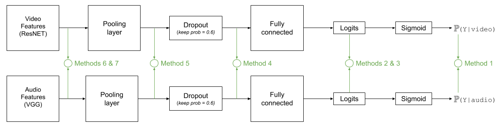

# Multimodal learning for Action Spotting Task on SoccerNet dataset

Implementation for the paper [Improved Soccer Action Spotting Using Both Audio and Video Streams](https://openaccess.thecvf.com/content_CVPRW_2020/html/w53/Vanderplaetse_Improved_Soccer_Action_Spotting_Using_Both_Audio_and_Video_Streams_CVPRW_2020_paper.html).

This repository proposes an approach to show that using audio streams for soccer action spotting improves the performance.

We tried several methods to merge visual and audio features with the baseline model provided by S. Giancola [1], as illustrated on the Figure below.



## Abstract
 In this paper, we propose a study on multi-modal (audio and video) action spotting and classification in soccer videos. Action spotting and classification are the tasks that consist in finding the temporal anchors of events in a video and determine which event they are. This is an important application of general activity understanding. Here, we propose an experimental study on combining audio and video information at different stages of deep neural network architectures. We used the SoccerNet benchmark dataset, which contains annotated events for 500 soccer game videos from the Big Five European leagues. Through this work, we evaluated several ways to integrate audio stream into video-only-based architectures. We observed an average absolute improvement of the mean Average Precision (mAP) metric of 7.43% for the action classification task and of 4.19% for the action spotting task.

## Authors
* Bastien Vanderplaetse (bastien.vanderplaetse@umons.ac.be) - [GitHub](https://github.com/bastienvanderplaetse)
* Stéphane Dupont (stephane.dupont@umons.ac.be) - [GitHub](https://github.com/stephanendupont)


## SoccerNet Dataset & Features
The SoccerNet dataset [1] and visual features were downloaded by following the instructions [here](https://github.com/SilvioGiancola/SoccerNet-code).

Audio features were extracted by using the VGGish [2] implementation available [here](https://github.com/DTaoo/VGGish) and can be downloaded [here](https://drive.google.com/file/d/1K4mwl72D7Y3zsJPt7fJQFo4q0X9Z8wCB/view).

The VGGish weights used can be downloaded [here](https://drive.google.com/file/d/16JrWEedwaZFVZYvn1woPKCuWx85Ghzkp/view).

## Requirements
* Python-3.6+
* Tensorflow-gpu-1.14
* Numpy

## Training and testing scripts
To train the network (action classification task):
```bash
python ClassificationMinuteBased.py --architecture AudioVideoArchi5 --training listgame_Train_300.npy --validation listgame_Valid_100.npy --testing listgame_Test_100.npy --featuresVideo ResNET --featuresAudio VGGish --PCA --network VLAD --tflog Model --VLAD_k 512 --WindowSize 20 --outputPrefix vlad-archi5-20sec  --formatdataset 1
```
To test the network (action spotting task):
```bash
python ClassificationSecondBased.py --testing listgame_Test_100.npy --featuresVideo ResNET --featuresAudio VGGish --architecture AudioVideoArchi5 --network VLAD --VLAD_k 512 --WindowSize 20 --PCA --output VLAD-Archi5-20sec-Spotting
```
To compute average-mAP:
```bash
python compute_mAP.py
```

Our best model's weights will be soon available to download.

## References
[1] Silvio Giancola, Mohieddine Amine, Tarek Dghaily, and Bernard Ghanem. Soccernet: A scalable dataset for action spotting in soccer videos. In The IEEE Conference on Computer Vision and Pattern Recognition (CVPR) Workshops, June 2018. - [[Paper](openaccess.thecvf.com/content_cvpr_2018_workshops/papers/w34/Giancola_SoccerNet_A_Scalable_CVPR_2018_paper.pdf)] - [[GitHub](https://github.com/SilvioGiancola/SoccerNet-code)]

[2] Karen Simonyan and Andrew Zisserman. Very deep convolutional networks for large-scale image recognition. arXiv1409.1556, 09 2014 - [[Paper](https://arxiv.org/abs/1409.1556)]
